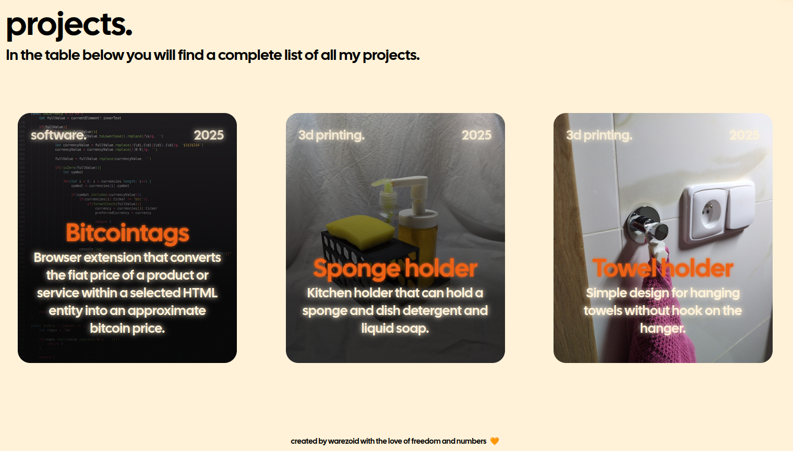

# warezoid.com
[warezoid.com](https://warezoid.com/) repository serves as repository for my personal portfolio website, which contains several interesting components created according to my own concept.


## Table of content
- [License](#license)
- [Components](#components)
    - [Project slideshow](#project-slideshow)
        - [HTML](#html)
        - [JavaScript](#javascript)
            - [Projects rendering](#projects-rendering)
            - [Changing slideshowIndex](#changing-slideshowindex)
    - [Project overview](#project-overview)
        - [HTML](#html-1)
        - [JavaScript](#javascript-1)
            - [Render projects](#render-projects)
    - [Project filtering](#project-filtering)
        - [HTML](#html-2)
    - [Photo gallery](#photo-gallery)
- [Sources](#sources)


## License
Project is licensed under the MIT License, except for the contents of the directories listed below. Full text of the license can be found [here](./LICENSE.md). For more information, please visit [Wikipedia - MIT License](https://en.wikipedia.org/wiki/MIT_License).

```
/src/font
/src/img/blobs
/src/img/icons
```


## Components
Below is a general description of how the components that interest me on [warezoid.com](https://warezoid.com/) work.


### Project slideshow
Project slideshow is a component used to present a selection of my projects. The content of the component changes at certain intervals, creating the impression of a slideshow.


#### HTML
Only the content changes in the HTML section. Below you will find the HTML skeleton.

```html
<div class="projects-slideshow">
    <div class="one-project" id="slideshow">
        <div class="one-project-toolbar">
            <div id="slideshow-loading"></div>
            <p id="slideshow-type">...</p>
        </div>

        <div class="one-project-text">
            <h3 id="slideshow-name">...</h3>
            <p id="slideshow-description">...</p>
        </div>
    </div>
</div>

<!-- index.html line 83 -->
```

#### JavaScript
All projects included in the project slideshow are stored in an object array called **slideshowProjects** with the following structure. Short descriptions of individual properties have been added.

```javascript
/*
    id: project id, used while rendering project slideshow
    type: project type (software, 3d printing, ...), used to sort projects
    background: path to background image
    name: project name
    link: link to project page
    description: short description of the project
*/

const slideshowProjects = [
    {
        id: ...,
        type: "...",
        background: "...",
        name: "...",
        link: "...",
        description: "..."
    },
]

// script.js line 144
```

##### Projects rendering
The entire rendering of objects depends on the **slideshowIndex** variable, which is changed at certain time intervals. The function that renders objects is shown below.

```javascript
let slideshowIndex = 0
let slideShowInterval

const slideshow = document.getElementById("slideshow")
const slideshowType = document.getElementById("slideshow-type")
const slideshowName = document.getElementById("slideshow-name")
const slideshowDescription = document.getElementById("slideshow-description")
const loadingCircle = document.getElementById("slideshow-loading")

const updateSlideshow = () => {
    let obj = slideshowProjects[slideshowIndex]

    slideshow.style.backgroundImage = `url(.../${obj.background})`
    slideshowType.innerText = `${obj.type}.`
    slideshowName.innerText = `${obj.name}`
    slideshowDescription.innerText = `${obj.description}`

    startLoading()
}

// script.js line 163
```

**startLoading** function is responsible for animating the loading wheel in the upper left corner.


Below you will find the code of **startLoading** function:

```javascript
let progress
let loadingInterval

const startLoading = () => {
    clearInterval(loadingInterval)
    progress = 0

    loadingInterval = setInterval(() => {
        progress++
  
        if(progress > 100){
            clearInterval(loadingInterval)
            
            return
        }
               
        loadingCircle.style.background = `conic-gradient(#fff2d8 0% ${progress}%, #fff2d886 ${progress}% 100%)`
    }, 75)
}

// script.js line 119
```

##### Changing slideshowIndex
**startSlideshow** function gradually increments the value of the **slideshowIndex** variable at regular intervals in the range *<0; slideshowProjects.length - 1>* to prevent overflow. The corresponding code is shown below.

```javascript
const startSlideshow = () => {
    startLoading()

    slideShowInterval = setInterval(() => {
        if(slideshowIndex == slideshowProjects.length - 1){
            slideshowIndex = 0
        }
        else{
            slideshowIndex++
        }
        
        slideshow.style.animation = "fadeOut 0.2s forwards"
    }, 8000)
}

slideshow.addEventListener("animationend", (e) => {
    if(e.animationName == "fadeOut"){
        slideshow.style.animation = "fadeIn 0.2s forwards"
        updateSlideshow()
    }
})

// script.js line 183
```

To complete the code, you need to add a function that redirects users to the current project page when they click on the slideshow.

```javascript
slideshow.addEventListener("click", () => { 
    window.location.href = slideshowProjects[slideshowIndex].link
})

// script.js line 205
```

The entire functionality is then launched by calling the **startSlideshow** function.

```javascript
startSlideshow()

// script.js line 74
```


### Project overview
Project overview ensures that projects stored in the internal database are rendered on the page.



#### HTML
HTML part of project overview include only following code, which is container for the rendered elements.

```html
<div id="project-overview"></div>

<!-- project-overview.html line 30  -->
```

Both JavaScript files must be linked with the module type.

```html
<script type="module" src="project-database.js"></script>
<script type="module" src="project-overview.js"></script>

<!-- project-overview.html line 117  -->
```

#### Javascript
All projects displayed in the project overview are stored in the **project-database.js** file in the following structure. A simple description of the structure is provided here.

```javascript
/*
    active: bool variable used to filter elements
    link_url: link to project page
    link_params: additional link parameters
    link_background: source of background image
    type: project type
    date: project release date
    project_name: name of project
    project_desc: project description
*/

export const allProjects = [
    {
        active: ...,
        link_url: "...",
        link_params: `...`,
        link_background: "...",
        type: "...",
        date: "...",
        project_name: "...",
        project_desc: "..."
    }
]

// project-database.js line 1
```

##### Render projects
First, we need to import **allProjects** from **project-database.js**.

```javascript
import { allProjects } from "./project-database.js"

// project-overview.js line 82
```

Function that renders elements to the page is called **renderProjects** and simply renders all elements from **allProjects** that have the **active** parameter set to *true*. **renderProjects** function is shown below.

```javascript
const projectOverview = document.getElementById("project-overview")

const renderProjects = () => {
    projectOverview.innerHTML = ""

    allProjects.forEach((oneProject) => {
        if(oneProject.active){
            projectOverview.innerHTML += `
                <a href="${oneProject.link_url}" ${oneProject.link_params}>
                    <div class="one-project" style="background-image: url(${oneProject.link_background});">
                        <div class="one-project-toolbar">
                            <p>${oneProject.type}.</p>
                            <p>${oneProject.date}</p>
                        </div>

                        <div class="one-project-text">
                            <h3>${oneProject.project_name}</h3>
                            <p>${oneProject.project_desc}</p>
                        </div>
                    </div>
                </a>
            `
        }
    })
}

// project-overview.js line 84
```


### Project filtering
Project overview also features functional project filtering.


#### HTML
The HTML code consists of two parts. The first part is the filter button.

```html
<div id="filter-buttons" class="button">
    <span class="filter-text">filter.</span>

    <div class="filter-image">
        
    </div>
</div>

<!-- project-overview.html line 52 -->
```

The second part is a popup filter, which is activated by pressing the filter button and allows the user to enter filtering parameters.

```html
<div id="filter-popup">
    <div class="filter-container">
        <div id="filter-close-container">
            <span>filter.</span>
            <span id="close-button">&#10006;</span>
        </div>

        <div class="filter-content">
            <div class="filter-content-container">
                <h3>type.</h3>

                <div class="filter-checkbox-container">
                    <div class="checkbox-label-container">
                        <label for="type-software">software.</label>
                        <input type="checkbox" id="type-software">
                    </div>

                    <div class="checkbox-label-container">
                        <label for="type-3dprinting">3d printing.</label>
                        <input type="checkbox" id="type-3dprinting">
                    </div>
                </div>
            </div>
                
            <div class="filter-content-container">
                <h3>date.</h3>

                <div class="filter-checkbox-container">
                    <div class="checkbox-label-container">
                        <label for="date-2024">2024.</label>
                        <input type="checkbox" id="date-2024">
                    </div>

                    <div class="checkbox-label-container">
                        <label for="date-2025">2025.</label>
                        <input type="checkbox" id="date-2025">
                    </div>
                </div>
            </div>
        </div>
    </div>
</div>

<!-- project-overview.html line 70 -->
```


### Photo gallery


## Sources
Sources can be seen as links to products used in [warezoid](https://warezoid.com/), including APIs, graphics and research tools. I have chosen not to list elementary products such as HTML, CSS, JavaScript, and many others.

- **Graphics**
    - Github - logo and space for collaboration: [github.com](https://github.com)
    - Google Fonts - font used in warezoid: [fonts.google.com](https://fonts.google.com/)
        - Cal Sans - specific font used in warezoid: [Cal Sans - Google Fonts](https://fonts.google.com/specimen/Cal+Sans)
    - Haikei - blob generation app: [haikei.app](https://haikei.app/)
    - SVGrepo - SVG icons library: [svgrepo.com](https://svgrepo.com/)
    - Figma - warezoid.com design: [figma.com](https://figma.com/)
    - FreeConverter - online file format converter: [freeconvert.com](https://www.freeconvert.com)
    - ezgif - online GIF maker: [ezgif.com](https://ezgif.com/)

- **APIs**
    - KUTE.js - used to animate blobs: [KUTE.js](https://thednp.github.io/kute.js/)

- **Research tools**
    - ChatGPT: [chatgpt.com](https://chatgpt.com)
    - DeepL: [deepl.com](https://deepl.com)
    - Stackoverflow: [stackoverflow.com](https://stackoverflow.com)
    - And the internet itself.

- **Validators**
    - HTML validator: [validator.w3.org](https://validator.w3.org)
    - CSS validator: [jigsaw.w3.org/css-validator](https://jigsaw.w3.org/css-validator)


###### Created by warezoid with the love of freedom and numbers. 🧡